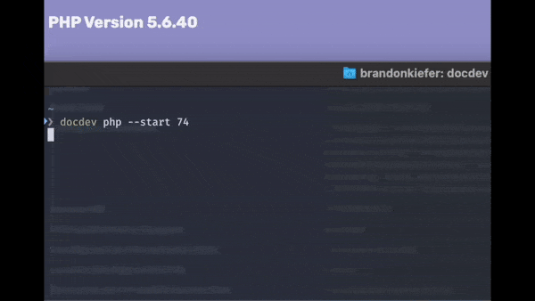

# DocDev



<!-- TOC -->

- [DocDev](#docdev)
    - [Getting Started](#getting-started)
        - [Basic Usage](#basic-usage)
    - [Managing Projects](#managing-projects)
        - [Configuring](#configuring)
        - [Adding](#adding)
    - [Routing & DNS](#routing--dns)
    - [Environment Variables](#environment-variables)
        - [$USER/.bashrc](#userbashrc)
        - [$DOCDEV_PATH/.env](#docdev_pathenv)
    - [CLI](#cli)
    - [Extra](#extra)
        - [Alpine](#alpine)
        - [Xdebug - VSCode](#xdebug---vscode)

<!-- /TOC -->

## Getting Started

1. Download the latest binary from https://github.com/phpdocdev/docdev/releases
2. Expose the binary to your $PATH
   1. `mv docdev-{OS}-{ARCH} /usr/local/bin/docdev`
   2. `chmod +x docdev`
3. In your shell, run `docdev` and execute the output:
   - `echo "export DOCDEV_PATH=/Users/$USER/docdev" >> ~/.zshrc`
4. Reload your profile and run `docdev start`
   - This will clone the repository to your `$DOCDEV_PATH` and start the containers with default values.

### Basic Usage

- Start the containers and install certificates
   - `docdev start`
- Verify everything is working as expected and your configuration is valid
   - `docdev test`
- Shell into the php container
   - `docdev exec`
- Change PHP version and start the containers
   - `docdev php -s 74`
- Update to the latest release
   - `docdev selfupdate`
- Re-pull images and changes from git (after updating the binary)
   - `docdev refresh`

## Managing Projects

- All projects are served from `$DOCUMENTROOT` with the folder name resembling the hostname.
  - `~/repos/proj1` translates to `http(s)://proj1.loc`
- Projects are served via ports 80 and 443, by default

### Configuring

- The webserver's document root serves from each project's `public` folder
  - For projects without a `public` directory (`~/repos/proj2/web`), add a symlink:
    - `ln -s web/ public`

### Adding

When new projects are added, you must:

- Generate a new certificate:
  - `docdev certs && docdev start`
- Configure your hostnames (only if you're using the **Hosts** DNS option)
  - `docdev hosts`

## Routing & DNS

You have a variety of options to setup DNS. Ultimately it makes no difference which method you choose.

- **Option 2**: [Hosts](docs/DNS.md##hosts)
- **Option 2**: [System-wide DNS](docs/DNS.md##system-wide-dns)
- **Option 3**: [Setup dnsmasq](docs/DNS.md#dnsmasqdn)
- **Option 4**: [Setup dns-vpn](docs/DNS.md#docker-vpn)

## Environment Variables

### $USER/.bashrc


| ENV         | Example               | Required                                  |
| ------------- | ----------------------- | ------------------------------------------- |
| DOCDEV_PHP  | *74*                  | Used for shell integrations, not required |
| DOCDEV_PATH | */path/to/docker-dev* | Required to run the CLI utility           |

### $DOCDEV_PATH/.env

| ENV                 | Default         | Example                 | Info                            | Required |
| --------------------- | ----------------- | ------------------------- | --------------------------------- | ---------- |
| DOCUMENTROOT        |                 | *~/repos/*              | Path to your projects           | ✅       |
| PHPV                |                 | *74*                    | Selected PHP version            | ✅       |
| DOCKER_HOST_IP      |                 | *192.168.65.2*          | Docker subnet host IP           | ✅       |
| TLD_SUFFIX          | *.loc           | *\*.tld*                | TLD for accessing projects      | ✅       |
| DNS                 | 192.168.103.106 | *192.168.0.16,192...*   | Docker container DNS            | ✅       |
| DNS_FORWARDERS      |                 | *9.9.9.9,1.1.1.1*       | Bind9 DNS forwarding            | ❌       |
| EXTRA_HOSTS         |                 | *example.com=127.0.0.1* | Hostname routing                | ❌       |
| ENABLE_MODULES      |                 | *pgsql pdo_pgsql*       | Extra PHP extensions to install | ❌       |
| REDIS_HOST          | *{host}*        | *192.168.0.15*          | *my.redis.com*                  | ❌       |
| MYSQL_HOST          | *{host}*        | *192.168.0.15*          | *my.mysql.com*                  | ❌       |
| MYSQL_ROOT_PASSWORD |                 | *secret*                | MySQL password                  | ❌       |

## CLI

```
NAME:
   docdev - vX.X

USAGE:
   docdev [global options] command [command options] [arguments...]

COMMANDS:
   init, i     Initialize configuration and install mkcert
     --tld          TLD for project hostnames (default: loc)
     --root         Root directory containing your projects (default: $USER/repos/)
     --php          Initial PHP version (default: 74)
     --certs        Generate and install certificates
     --hosts        Generate hosts file
     --start        Start containers immediately
   certs, c    Generate and install the certificates
   hosts       Generate a new hosts profile and add it to your system /etc/host
     --dry-run      Dry run
   start, s    Bring up the docker containers
     --php-only     Reset the PHP container
     --exec         Start container shell after starting
   exec, e     Start docker container shell
   test, t     Test your configuration.
   php, p      Change php version (requires "start" to rebuild). Valid values: 54, 56, 72, 74
     --start        Start the containers after switching the PHP version
     --php-only     Reset the PHP container
   refresh     Pull changes from git and images from Docker
   selfupdate  Update docdev binary, requires "gh"
   help, h     Shows a list of commands or help for one command

GLOBAL OPTIONS:
   --help, -h     show help (default: false)
   --version, -v  print the version (default: false)
```

## Extra

### Alpine

Some containers have an "Alpine" alternative. To utilize these variants:
   - Append `-alpine` to your `$PHPV` variable
      - `74-alpine`
   - Append `-alpine` to the `docker-compose.yml` image paths
      - ` ghcr.io/phpdocdev/php:${PHPV}-alpine`
   - CLI: `docdev php 56-alpine`

### Xdebug - VSCode

`settings.json`

```json
 "launch": {
    "version": "0.2.0",
    "configurations": [
      {
        "name": "docdev",
        "type": "php",
        "request": "launch",
        "hostname": "localhost",
        "log": true,
        "port": 9000,
        "externalConsole": false,
        "pathMappings": {
          "/var/www/html/${workspaceFolderBasename}": "${workspaceFolder}"
        },
      }
    ]
  },
```
