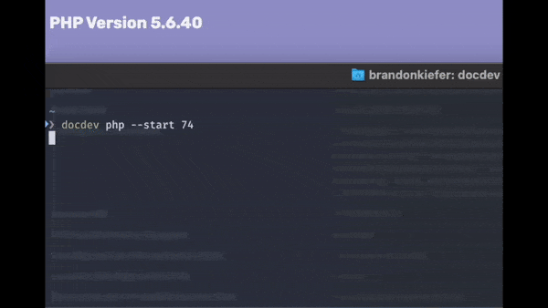

# Docker Dev Environment



Source files for Docker images, docdev command, and release strategy: https://github.com/phpdocdev/docdev-cli

Download the latest release: https://github.com/phpdocdev/docdev/releases

## Prerequisites

`MySQL` and `Redis` are both served from your host machine and are accessible via `mysql` and `redis` hostnames in your application. I reccomend using [DBNgin](https://dbngin.com) to host the services on your host machine.

## Env


| ENV         | Example               | Required                                  |
| ------------- | ----------------------- | ------------------------------------------- |
| DOCDEV_PHP  | *74*                  | Used for shell integrations, not required |
| DOCDEV_PATH | */path/to/docker-dev* | Required to run the CLI utility           |

## Commands

```
NAME: docdev

USAGE:
   docdev [global options] command [command options] [arguments...]

COMMANDS:
   init, i     Initialize configuration and install mkcert
   certs, c    Generate and install the certificates
   hosts       Generate a new hosts profile and add it to your system /etc/host
   start, s    Bring up the docker containers
   exec, e     Start docker container shell
   test, t     Test your configuration.
   php, p      Change php version (requires "start" to rebuild). Valid values: 54, 56, 72, 74
   refresh     Pull changes from git and images from Docker
   selfupdate  Update docdev binary
   version, v  Output current version.
   help, h     Shows a list of commands or help for one command

GLOBAL OPTIONS:
   --dry-run, -d  Dry run (default: false)
   --help, -h     show help (default: false)
```

## Command Usage

Create .env, certificates, and modified hosts file then starts the containers.

`./docdev init --tld loc --php 74 --root /my/projects/dir/ --certs --hosts --start`

* `--tld loc` will be the TLD for the projects, making them accessible at `https://{project}.loc`
* `--php 74` is the initial PHP version and may be changed later.
* `--root /my/project/dir/` should be the parent folder of your git repositories. Any folder located within the root directory will represent a hostname. `/my/project/dir/repo1` will be accessible via `https://repo1.loc`.
* `--certs` will install `mkcert` and then generate a certificate that includes each hostname in your root project directory. If the root CA is not found in your keychain, it will be added and trusted automatically.
* `--hosts` will install `hostctl` and generate a new `/etc/host` file with all of your hostnames pointed to your localhost, which will be picked up by bindns. You will need to enter your password to replace your existing host file.
* `--start` will start the containers after the initialization is complete.

```shell
USAGE:
   docdev init [command options] [arguments...]

OPTIONS:
  --tld value, -t value   TLD for project hostnames (default: "loc")
   --root value, -r value  Root directory containing your projects (default: "$HOME/repos/")
   --php value, -p value   Initial PHP version (default: "74")
   --certs                 Generate and install certificates (default: false)
   --hosts                 Generate hosts file (default: false)
   --start                 Start containers immediately (default: false)
   --dry-run, -d           Dry run (default: false)
   --help, -h              show help (default: false)
```

### Create SSL certificate and CA

`docdev certs`

### Create host file

> Dry run by appending `-d`

`docdev hosts`

### Start the containers and install certificates

`docdev start`

### Shell into the php container

`docdev exec`

### Change PHP version and start the containers

`docdev php -s 74`

# Usage

## Environment

### Automatic

Run `./docdev init` with the appropriate options:

### Manually

In your `.env` file, modify the value of `DOCUMENTROOT` to the directory containing your repositories. The folder names will represent the hostname to access the specific folder.

## Routing & DNS

You have a variety of options to setup DNS. Ultimately it makes no difference which method you choose.

- **Option 1**: Configure hosts by modifying /etc/hosts (`docdev hosts`)
  - Adding/removing projects will require you to run the command to refresh the entries
- **Options 2**: Use BIND as your primary DNS server (for all DNS queries)
  - Set your primary DNS server to `127.0.0.1`
- **Option 3**: [Setup dnsmasq](docs/DNS.md)
- **Option 4**: Add the openvpn container to your configuration and utilize the connection to serve DNS. See: https://github.com/phpdocdev/dns-vpn

## Project Configuration

Apache is configured to serve from the `public` folder of each project. If you're dealing with a non-laravel project, set up a symlink: `ln -s web/ public`

## Access

You will access your projects via `https://myproject.loc`

> If you add any new projects, simply run `./docdev certs && ./docdev start` to refresh the pathings.

## Xdebug

### VSCode

`settings.json`

```json
 "launch": {
    "version": "0.2.0",
    "configurations": [
      {
        "name": "docdev",
        "type": "php",
        "request": "launch",
        "hostname": "localhost",
        "log": true,
        "port": 9000,
        "externalConsole": false,
        "pathMappings": {
          "/var/www/html/${workspaceFolderBasename}": "${workspaceFolder}"
        },
      }
    ]
  },
```
